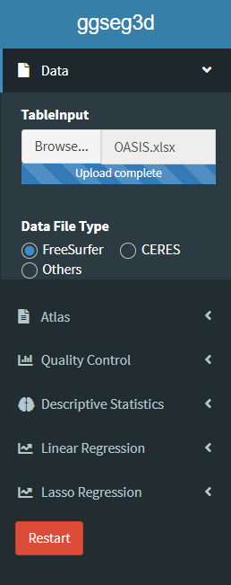
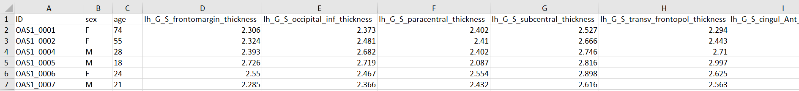
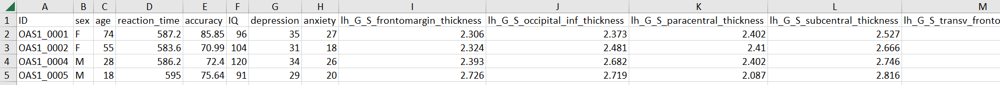
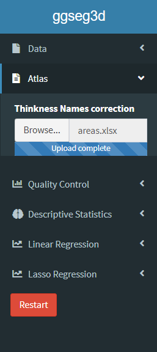
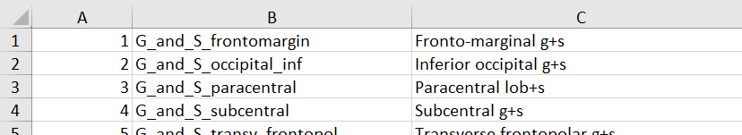
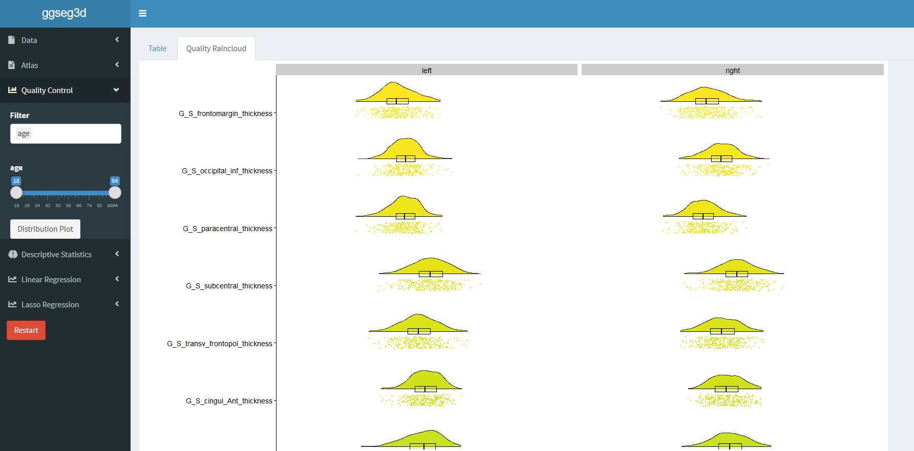
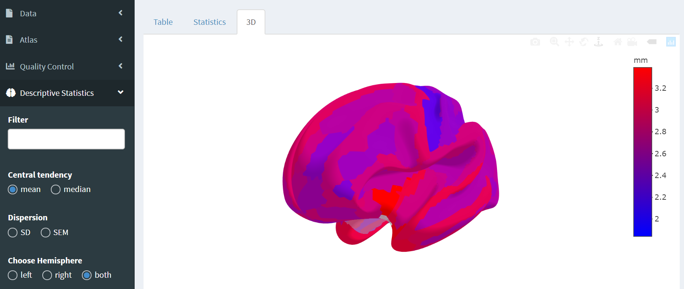
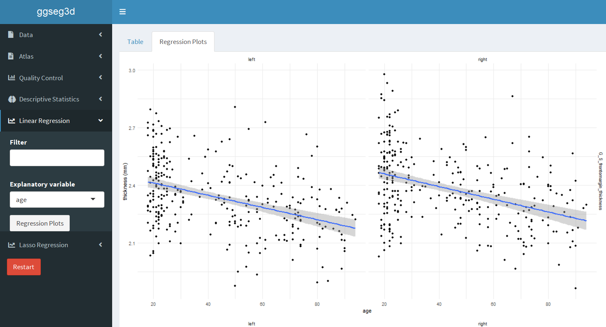
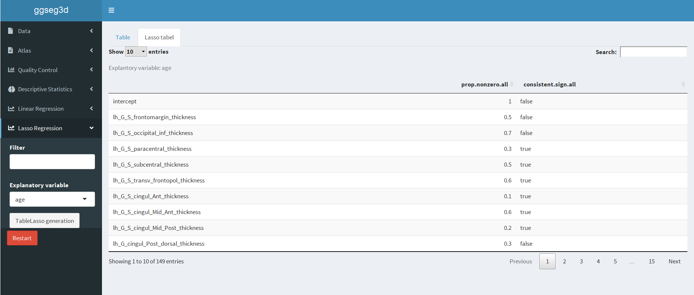

- [Home](./index.md)
- [Installation](./install.md)
- [Guide](./use.md)
- [About](./about.md)

## Load the data

The file must be in .csv or .xlsx format.

"The data order of the columns is ID, sex, age, reaction time, IQ, depression, anxiety. Columns 8-155 are 74 regions of the left hemisphere and 74 regions of the right hemisphere. All column names must exist, but related data can be null. In this OASIS data set, there are 300 data sets in total." 

You can filter the columns and information as you wish. To restart the Shiny App use the Restart-Button.

## Load the atlas

Different users have different names for the same brain region, so in this Shiny App you can import a file for this. The file must be also in .csv or .xlsx format. 

You can customize the brain region name to the name you want with the template areas.xlsx. In this file, the left column is the original name of the region (do not change) and in the right column is the user-defined name.

## Functions

### Quality Control with Raincloud-Plots:

### Descriptive Statistics:

### Linear Regression:

### Lasso Regression:
